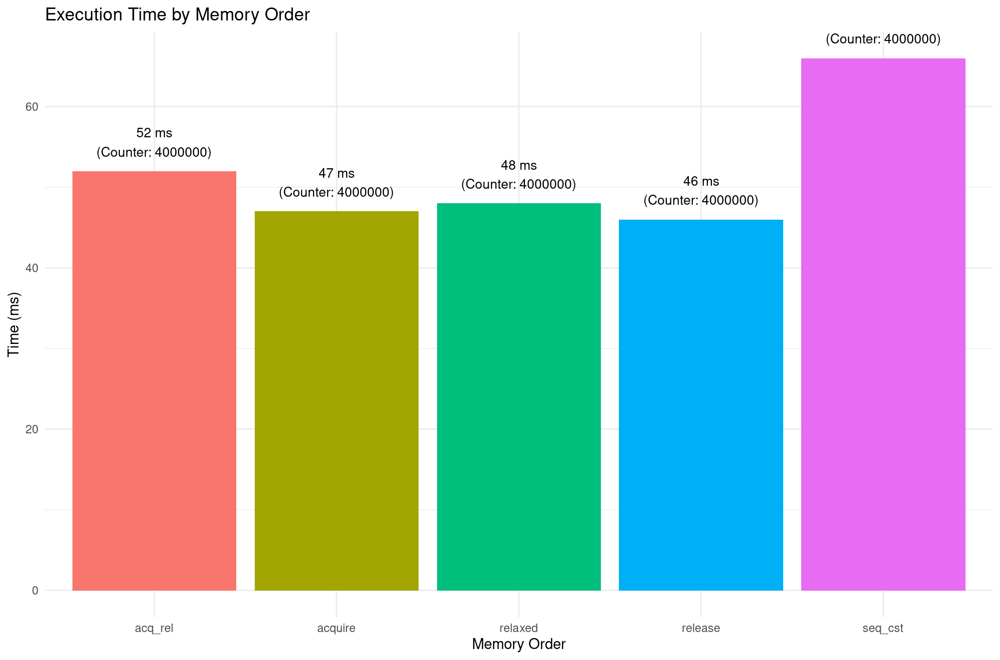

# Thread-Safe Counter Performance Benchmark

## Overview

This project benchmarks the performance implications of using different **C++ atomic memory orders** when incrementing a shared counter across multiple threads. The goal is to quantitatively compare how memory consistency models affect execution time while maintaining thread safety in a multithreaded environment.

Atomic operations are central to concurrent programming. However, their performance characteristics can vary depending on the **memory ordering** constraints used. This benchmark demonstrates these differences across five standard memory orderings in C++: `seq_cst`, `relaxed`, `acquire`, `release`, and `acq_rel`. The output includes precise timing measurements and generates a CSV file and a visual bar plot for comparative analysis.

## How Does It Work?

### Memory Ordering in C++

The C++11 memory model introduced atomic operations with explicit memory ordering semantics, defined in the `<atomic>` header. These semantics control **how operations on memory appear to other threads**, particularly in terms of reordering and visibility. Here's a brief explanation of the memory orders tested:

1. **memory_order_seq_cst** (Sequentially Consistent): The default and strongest ordering. It prevents both compiler and CPU reordering and ensures a single total order across all threads. This provides maximum safety but at the cost of performance due to synchronization fences.
   
2. **memory_order_relaxed**: Imposes no ordering constraints. It guarantees atomicity but not visibility, making it the fastest but only suitable when data race conditions are otherwise prevented by design.

3. **memory_order_acquire**: Prevents reordering of reads and writes after the acquire operation. Typically used in lock-free designs to ensure visibility of prior writes.

4. **memory_order_release**: Prevents reordering of reads and writes before the release operation. Often paired with acquire to implement safe handoffs.

5. **memory_order_acq_rel**: Combines both acquire and release semantics. Ensures a happens-before relationship in both directions across threads.

### Implementation

Each test launches `N` threads, where each thread performs `M` atomic increments on a shared counter. The time taken is measured using a custom timer class. Results are collected in a CSV file and plotted using R for performance visualization. The counter value is loaded with a memory order that reflects the corresponding test.

The plotted results provide a clear comparative view of how each memory ordering impacts runtime over 4 million atomic operations (e.g., 4 threads × 1 million operations).

## Build & Run

### Clone and Build

```bash
git clone https://github.com/AniDashyan/thread_safe_counter.git
cd thread_safe_counter
cmake -S . -B build
cmake --build build --config Release
```

### Run the Executable

```bash
build/counter --thread [N] --iter [M]
```

Replace `[N]` with the number of threads and `[M]` with the number of increments per thread. For example:

```bash
build/counter --thread 4 --iter 1000000
```

This runs the benchmark with 4 threads, each performing 1,000,000 atomic increments.

## Example Output

```
Warning:  Using default values for threads and increments.
Configuration:
Threads: 4
Increments/thread: 1000000
 
 
Memory Order Counter      Time (ms) 
 
------------------------------------ 
seq_cst      4000000      57        
relaxed      4000000      55        
acquire      4000000      55        
release      4000000      57        
acq_rel      4000000      59        

Results written to results.csv for plotting
```

### Visual Representation

The bar chart below (from the `mem_order_plot.png`) displays the execution time for each memory order:



This visualization confirms the performance cost of stricter memory models, with `seq_cst` taking the longest and `release`, `acquire`, and `relaxed` showing significantly better timings.

## Additional Notes

- The `kaizen.h` file provides utility functions such as logging, timing, and argument parsing.
- Results are written to `results.csv` and can be visualized using R or Python. An example R script is included for generating the bar chart.
- On systems with many cores, memory order differences may be more pronounced due to cache coherency and CPU pipeline effects.

## Historical Context

Memory models have been a foundational concept in concurrent programming since the late 1970s when multiprocessor systems first emerged. The C++11 standard formally introduced a consistent memory model inspired by the work of Sarita Adve and others in the late 1990s on weak memory models. The goal was to balance **performance optimization** (such as instruction reordering by compilers and CPUs) with **programmer guarantees** for correctness.

The sequentially consistent model, proposed by Leslie Lamport in 1979, assumes a global ordering of operations and is the most intuitive, but it restricts many hardware and compiler optimizations. In contrast, relaxed and release/acquire models allow for reordering as long as certain data visibility and synchronization rules are maintained.

## Applications

Understanding memory ordering is essential in:

- Writing lock-free data structures
- Designing high-performance concurrent libraries
- Systems programming, particularly in OS kernels or embedded systems
- Synchronization in distributed computing where latency and throughput are critical
